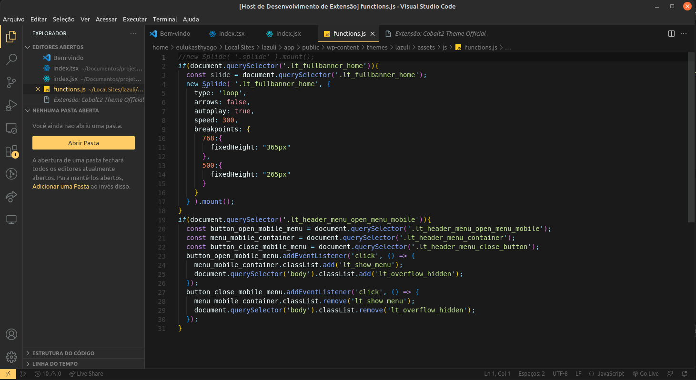

# Bee Theme 2.0

Theme developed by [Web Colmeia](https://webcolmeia.com.br/) / [Lucas Tiago](https://github.com/eulukasthyago).

This theme has colors based on bees with pastel tones.

## Authors

- [@eulukasthyago](https://www.github.com/eulukasthyago)
- [@webcolmeia](https://www.github.com/webcolmeia)

## Web Colmeia Colors

| Colors               | Hexadecimal                                                |
| ----------------- | ---------------------------------------------------------------- |
| Primary color      |  #FFC864  |
| Secondary Color / Backgrounds       |  #2A2A2A |
| Text Color       |  #CCD6DD |
| Other Text Color       |  #99A9B5 |

